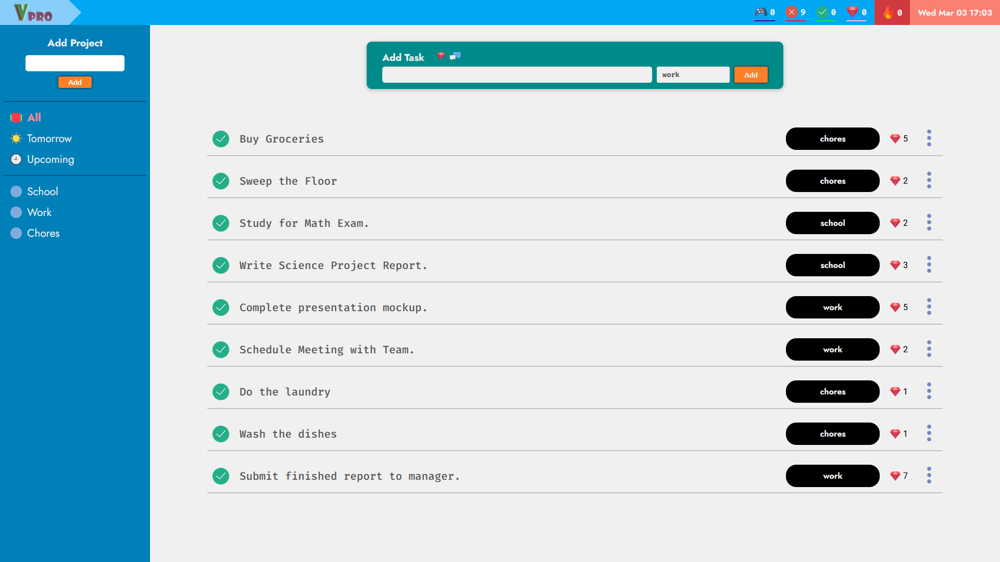

# Vanguard Pro
A web app that helps the user to be more productive and have fun at the same time. The user may earn points, get achievements, unlock new features and build streaks. It can gather data from the user’s gaming platform (initially Steam) via API to send alerts and may warn the player if they have exceeded their allotted playtime.

> Developed for the Seneca Digital Health Hackathon 2021.

## Developers
- Brian Kong
- Foster Hangdaan
- Mark Brierley
- Matthew Percy
- Ruben Roso Hui

## Screenshots
### Tasks Page


## Project setup

### Install dependencies.
```
npm install
```

### Compiles and hot-reloads for development
```
npm run serve
```

### Compiles and minifies for production
```
npm run build
```

### Lints and fixes files
```
npm run lint
```

### Customize configuration
See [Configuration Reference](https://cli.vuejs.org/config/).
